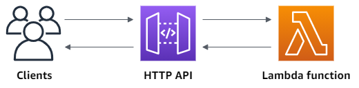

# Serverless Framework 亚马逊云(AWS)中国地区部署指南

- [Serverless Framework 亚马逊云(AWS)中国地区部署指南](#serverless-framework-亚马逊云aws中国地区部署指南)
  - [前言](#前言)
  - [前置准备](#前置准备)
    - [1. 账号的注册](#1-账号的注册)
    - [2. 全局安装 `serverless`](#2-全局安装-serverless)
    - [3. 设置你的系统环境变量](#3-设置你的系统环境变量)
    - [4. 设置部署凭证](#4-设置部署凭证)
  - [快速部署一个 hello world](#快速部署一个-hello-world)
    - [创建入口函数 index.js](#创建入口函数-indexjs)
      - [`event` 参数](#event-参数)
      - [`context` 参数](#context-参数)
      - [函数体](#函数体)
    - [创建部署文件 serverless.yml](#创建部署文件-serverlessyml)
    - [部署](#部署)
  - [Next Chapter](#next-chapter)
  - [完整示例及文章仓库地址](#完整示例及文章仓库地址)

## 前言

`Serverless Framework` 是业界非常受欢迎的无服务器应用框架，开发者无需关心底层资源即可部署完整可用的 serverless 应用架构。Serverless Framework 具有资源编排、自动伸缩、事件驱动等能力，覆盖编码-调试-测试-部署等全生命周期，帮助开发者通过联动云资源，迅速构建 serverless 应用。

目前 `Serverless Framework` 默认支持, 同时也是支持最好的云服务商是 `亚马逊云(AWS)`，亚马逊云在中国地区,目前主要服务企业用户，而且只开放了 `宁夏` 和 `北京` 2个地域，基础设施方面分别属于 `西云数据` 和 `光环新网`。幸运的是亚马逊也给中国这 `2` 个地域添加了支持，地域分别为 `cn-northwest-1`(宁夏) 和 `cn-north-1`(北京)，所以我们部署的时候需要显式声明它们，不然就会因为中国和国外的账号不互通，导致部署失败。

接下来就让我们看看，如何快速部署函数在中国区的亚马逊上吧！

## 前置准备

1. 一个中国区亚马逊的账号
2. 全局安装 `serverless`
3. 设置你的系统环境变量
4. 设置部署凭证

### 1. 账号的注册

你可以登录 <https://www.amazonaws.cn/> 进行注册，记得提前准备好你的企业相关信息。

### 2. 全局安装 `serverless`

> 没有安装 nodejs 环境的，记得提前安装，官方链接：<https://nodejs.org/en>

执行 `npm install -g serverless` 来 全局安装 `serverless`

安装完成后，全局会注册2个指令:

- `serverless`
- `sls`

> `sls` 是 `serverless` 命令的简写，以后章节的命令都用 `sls`

执行 `sls -v` 出现:

```txt
Framework Core: 3.34.0
Plugin: 6.2.3
SDK: 4.3.2
```

这代表你已经安装成功了！

### 3. 设置你的系统环境变量

编辑你的系统环境变量，添加 `SLS_GEO_LOCATION=no-cn`

这是为了避免 `serverless cli` 在中国时区，默认走腾讯云云函数部署的行为。

### 4. 设置部署凭证

在亚马逊管理面板，点击右上角的 `安全凭证`，在 `我的安全凭证` 里的 `访问密钥` 中，点击 `创建访问秘钥`，创建使用案例为 `在 亚马逊云科技 计算服务上运行的应用程序`，同意条款后完成步骤。

这样你就生成了 `Access Key` 和 `Access Secret`。

然后为了本地使用 `Access Key` 和 `Access Secret` 去部署函数，我们需要创建 `"~/.aws/credentials"` 文件(`~`为当前用户目录)，内容如下:

```txt
[default]
aws_access_key_id=xxxx
aws_secret_access_key=xxx
```

这是为了让 `Serverless Framework` 去读取本地的访问凭证进行部署。不然你就需要去注册 `Serverless Framework Account` 来进行管理了。

## 快速部署一个 hello world

正常情况下你执行 `sls` 就会出现提示让你去新建一个函数项目，然而假如你之前没有添加 `SLS_GEO_LOCATION=no-cn` 这个环境变量的话，就会出现上述第3点问题：

```txt
Serverless Framework CLI no longer supports Serverless Tencent CLI

To run Serverless Framework without issues in China region, ensure: SLS_GEO_LOCATION=no-cn environment variable
```

然而，即使你添加了环境变量，顺利执行了 `sls` 来初始化项目，大概率也会因为一些未知的网络原因下载失败。

所以这里笔者推荐你直接去 <https://github.com/serverless/examples> 去下载模板。

这里推荐使用基础模板 [`aws-node-http-api`](https://github.com/serverless/examples/tree/v3/aws-node-http-api)

它部署成功后，能够快速为你创建一个 `AWS Lambda函数`(云函数) 和一个 `AWS API Gateway`(api网关)，这样你部署成功之后，`AWS API Gateway` 会直接给你分配一个http公网地址，你可以直接访问它来触发你的云函数。

整体的调用流程如下:



> 部署`AWS API Gateway`之后访问域名永远是 `403` 的问题，这是因为你需要在亚马逊中国完成 `ICP`备案，才能正常使用 `API` 网关，不然默认端口 `80/8080/443` 都是关闭的，所以返回都是 `403`:
>
> ```json
>{
>  "message": "Forbidden"
>}
>```

### 创建入口函数 index.js

我们新建一个函数文件夹 `aws-node-http-api`, 在里面创建 `index.js` 文件

```js
module.exports.handler = async (event, context) => {
  return {
    statusCode: 200,
    body: JSON.stringify(
      {
        message: "Go Serverless v3.0! Your function executed successfully!",
        input: event,
      },
      null,
      2
    ),
  };
};
```

代码解读:

这段代码使用 `commonjs` 格式编写，导出一个 `handler` 函数

这个函数有 `2` 个参数 `event` 和 `context` (实际上还有第三个参数 `callback`, 不过都已经 `3202`年了，回调写法早就不流行了，故省略，全篇使用 `async/await`)

#### `event` 参数

其中 `event` 为事件参数，我们云函数绑定的触发器在触发的时候，触发事件都会转化成这个对象来调用我们的代码。

比如我们一个函数绑定了多个触发器:

- HTTP 网关触发器
- S3/OSS/COS 这种对象存储触发器
- Schedule/Cron 这种job触发器

那它们各自触发函数的时候，进入我们函数时的 `event` 类型就是不同的，这样我们就可以根据这个类型，去执行不同的代码分支，返回不同的结果。

#### `context` 参数

`context` 参数指的是运行函数时，传入进来的上下文，这点每个云厂商都是不同的。但里面大多都会包含一些调用信息，函数信息，和执行的环境信息，以及暴露一些特定的方法。比如 `functionName` / `requestId` 等等...

这里笔者给出一份 `AWS` 在上下文中给你的字段清单链接，供你参考：

<https://docs.aws.amazon.com/lambda/latest/dg/nodejs-context.html>

#### 函数体

这里就是调用函数时去执行的代码片段了

这里我们就简单返回了一个 `js` 对象:

```js
  return {
    statusCode: 200,
    body: JSON.stringify(
      {
        message: "Go Serverless v3.0! Your function executed successfully!",
        input: event,
      },
      null,
      2
    ),
  };
```

为什么要返回成这个格式？ 实际上这是 `AWS API Gateway` 决定的，你要执行函数之后，获得结果再通过它返回给用户，就必须按照它要求的格式返回。

所以你可以看到这里返回了一个 `{ statusCode: number, body: string }` 格式。当然具体的格式不同的云厂商也会不同，这里我也为你找到了这个格式的百科大全文档:

<https://docs.aws.amazon.com/apigateway/latest/developerguide/http-api-develop-integrations-lambda.html>

所以你根据这个文档多返回一些字段以达到你 `set cookie` / `修改响应头` 的效果。

### 创建部署文件 serverless.yml

这里我们直接在刚刚创建的 `index.js` 同目录下，快速创建一个 `serverless.yml`，内容如下:

```yml
service: serverless-http-api
frameworkVersion: '3'

provider:
  name: aws
  runtime: nodejs18.x
  region: cn-northwest-1 # 中国宁夏

functions:
  api:
    handler: index.handler
    events:
      - httpApi:
          path: /
          method: get
```

这里我们重点介绍一下这些字段:

- `service` / `frameworkVersion` 都是元数据，来告诉云服务商/`serverless cli`，应用程序名是什么，使用的框架版本是什么

- `provider` 则是我们用来描述，使用的什么云服务商的，什么地域的，什么运行时来进行部署云函数

- `functions` 则是描绘函数的一些信息，比如这个 `yml` 中的 `functions` 区域块，就告诉云服务商，我有一个名为 `api` 的函数需要部署，它的函数触发入口点是我 `index.js` 导出对象中的 `handler` 函数，它还绑定了一个 `API网关(v2)` 触发器，用 `HTTP GET` 请求访问这个网关的 `/` 路径，就可以触发这个函数啦！

于是当我们声明完成这些信息之后，就可以愉快的部署了！

### 部署

我们直接在当前项目目录下执行:

```bash
sls deploy
```

于是我们的项目代码先是被本地打包到当前目录下的 `.serverless` 文件夹下方，然后 `serverless framework` 把我们函数压缩文件包(`.zip`) 上传到 `AWS` 上，告诉它进行部署，成功之后就会返回如下信息:

```txt
Deploying serverless-http-api to stage dev (cn-northwest-1)

✔ Service deployed to stack serverless-http-api-dev (152s)

endpoint: GET - https://xxxxxxxxxx.execute-api.cn-northwest-1.amazonaws.com/
functions:
  api: serverless-http-api-dev-api (1.9 kB)
```

这样我们第一个函数就部署成功了，你可以直接打开浏览器，敲这个地址就会返回数据:

```json
{
  "message": "Go Serverless v3.0! Your function executed successfully!",
  "input": {
    ...
  }
}
```

恭喜你！！！你正式踏入了 `serverless` 的世界！！！

接下来更广阔的世界会为你打开.

## Next Chapter

当然做到这些仅仅是入门，接下来我将会向你介绍更复杂的项目，带你走一遍我曾经走过的路。

下一篇，《typescript 支持与本地调试》中，将会介绍如何添加 `typescript` 支持和本地调试(这句有点废话了～)，欢迎阅读。

## 完整示例及文章仓库地址

<https://github.com/sonofmagic/serverless-aws-cn-guide>
