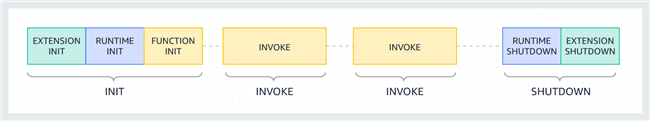

# lambda nodejs 函数降低冷启动时间的最佳实践

- [lambda nodejs 函数降低冷启动时间的最佳实践](#lambda-nodejs-函数降低冷启动时间的最佳实践)
  - [前言](#前言)
  - [什么是冷启动时间](#什么是冷启动时间)
  - [打包服务端 js](#打包服务端-js)
  - [什么是 inline](#什么是-inline)
  - [进一步封装的打包工具](#进一步封装的打包工具)
  - [弊端的解决方案](#弊端的解决方案)
  - [完整示例及文章仓库地址](#完整示例及文章仓库地址)

## 前言

> 本文章的思路，继承发展自这两篇文章:
>
> - [serverless 降低冷启动时间的探索 - 服务端打包 node_modules](https://zhuanlan.zhihu.com/p/407434947)
> - [Nodejs云函数冷启动时间的优化](https://zhuanlan.zhihu.com/p/429597900)
>
> 这里要感谢这`2`篇文章的作者:[`ice breaker`](https://www.zhihu.com/people/richard-40-19-41)，`2`年前就提供了这么优秀的思路和解决方案了，真是忍不住给他点赞呀。
>

首先在看这篇文章之前，我先必须给你介绍一个概念，就是 `冷启动时间`。

## 什么是冷启动时间

这个特性各个服务商的 `serverless` 云函数都存在，这个和 `函数容器的生命周期` 息息相关。

以 `Lambda` 为例，Lambda 生命周期可以分为三个阶段：

- **Init**：在此阶段，Lambda 会尝试解冻之前的执行环境，若没有可解冻的环境，Lambda 会进行资源创建，下载函数代码，初始化扩展和 Runtime，然后开始运行初始化代码（主程序外的代码）。
- **Invoke**：在此阶段，Lambda 接收事件后开始执行函数。函数运行到完成后，Lambda 会等待下个事件的调用。
- **Shutdown**：如果 Lambda 函数在一段时间内没有接收任何调用，则会触发此阶段。在 `Shutdown` 阶段，Runtime 关闭，然后向每个扩展发送一个 `Shutdown` 事件，最后删除环境。



当您在触发 Lambda 时，若当前没有处于激活阶段的 Lambda 可供调用，则 Lambda 会下载函数的代码并创建一个 Lambda 的执行环境。从事件触发到新的 Lambda 环境创建完成这个周期通常称为 “冷启动时间”。显然，这个时间肯定是越短越好的。

这里可以参考 AWS [这篇博客](https://aws.amazon.com/cn/blogs/china/4-solutions-to-reduce-the-cold-start-time-of-aws-lambda/) 以获取更多信息。

其中 AWS 提供的几种降低冷启动时间的方式有:

- 选择合适的编程语言
- 减小应用程序大小
- 预热 (定时触发器防止回收和预置并发，保留实例)
- JVM 分层编译(java特供)

而本篇文章要探讨的核心方式就是 `减小应用程序大小`

## 打包服务端 js

回到正题，为什么要去打包服务端 `js`? 用 `layer` 的方式不是蛮好吗？

这里必须要知道的一点是，函数冷启动的时间，是和整体运行的代码以及其依赖的大小，是息息相关的。

比如上篇文章中的示例，我们把 `uuid` 这个依赖给做成 `layer` 上传了上去，但是你有没有想过，既然 `uuid` 的所有实现都是 `js`，为什么不把它整个源代码，打入我们的函数构建产物中呢？这样还省了依赖一个 `layer` 呢。

同样的道理，我们函数也可以把 `express`,`lodash` 等等依赖，全部打入我们的函数包里去，以减小整体代码包的体积。

这就像我们在写前端项目那样，本质上也会把所有运行时代码，全部给 `inline` 到各个 `js` 里面去，毕竟浏览器可没有什么 `node_modules` 的加载机制。你写 `vue` 写 `react` 都是直接 `inline` 所有的代码的。

## 什么是 inline

这里给一个例子:

原先你的`ts`代码可能是这样写的:

```ts
import express from 'express'
```

然后经过 `tsc`，产物变成了这样：

```js
// commonjs 
const express = require('express')
```

而假如走 `inline` 那产物中就不会出现 `express`，而是直接把 `express` 相关的代码全部给打了进来:

```js
// 部分代码
var require_express = __commonJS({
  "../../node_modules/.pnpm/express@4.18.2/node_modules/express/lib/express.js"(exports, module2) {
    "use strict";
    var bodyParser2 = require_body_parser();
    var EventEmitter = require("events").EventEmitter;
    var mixin = require_merge_descriptors();
    var proto = require_application();
    var Route = require_route();
    var Router = require_router();
    var req = require_request2();
    var res = require_response2();
    exports = module2.exports = createApplication;
    function createApplication() {
      var app2 = function(req2, res2, next) {
        app2.handle(req2, res2, next);
      };
      mixin(app2, EventEmitter.prototype, false);
      mixin(app2, proto, false);
      app2.request = Object.create(req, {
        app: { configurable: true, enumerable: true, writable: true, value: app2 }
      });
      app2.response = Object.create(res, {
        app: { configurable: true, enumerable: true, writable: true, value: app2 }
      });
      app2.init();
      return app2;
    }
    exports.application = proto;
    exports.request = req;
    exports.response = res;
    exports.Route = Route;
    exports.Router = Router;
    exports.json = bodyParser2.json;
    exports.query = require_query();
    exports.raw = bodyParser2.raw;
    exports.static = require_serve_static();
    exports.text = bodyParser2.text;
    exports.urlencoded = bodyParser2.urlencoded;
    var removedMiddlewares = [
      "bodyParser",
      "compress",
      "cookieSession",
      "session",
      "logger",
      "cookieParser",
      "favicon",
      "responseTime",
      "errorHandler",
      "timeout",
      "methodOverride",
      "vhost",
      "csrf",
      "directory",
      "limit",
      "multipart",
      "staticCache"
    ];
    removedMiddlewares.forEach(function(name) {
      Object.defineProperty(exports, name, {
        get: function() {
          throw new Error("Most middleware (like " + name + ") is no longer bundled with Express and must be installed separately. Please see https://github.com/senchalabs/connect#middleware.");
        },
        configurable: true
      });
    });
  }
});
// ......
```

显然这种方式下，可以打出更小更单一的包，因为所以的 `js` 依赖，这么多碎片状的 `js` 都被打成到了一个文件里面去了，减少了 `io` 的次数，而且还能够一起压缩代码。

这种方式，许多打包工具都内置了，比如 `webpack/esbuild`，当然 `rollup` 也有对应的插件支持，[`@rollup/plugin-node-resolve`](https://www.npmjs.com/package/@rollup/plugin-node-resolve) 就是它的实现方式之一。

## 进一步封装的打包工具

在过去，我的实现方式是 `rollup` 或者 `esbuild`，不过现在有了基于它们更进一步的打包工具: `tsup`/`unbuild`。

其中 `unbuild` 我们会在 `monorepo` 章节中介绍它，这里我们主要来介绍 `tsup` 在函数打包中的用法。

`tsup` 本身的打包，主要是基于约定的：

比如它会默认去 `inline` 我们所有在运行时引用的，但是却是注册在 `devDependencies` 里的包

而 `dependencies` 里的包，则是被默认加入了 `external` 中，不进行 `node resolve`

简洁的配置文件见下：

```ts
// tsup.config.ts
import { defineConfig } from 'tsup'
const isDev = process.env.NODE_ENV === 'development'
export default defineConfig({
  entry: ['src/index.ts'],
  splitting: false,
  sourcemap: isDev,
  clean: true,
  // external: []
})
```

`package.json` 里的 `npm scripts`

```json
  "scripts": {
    "dev": "cross-env NODE_ENV=development tsup --watch",
    "build": "cross-env NODE_ENV=production tsup",
  },
```

## 弊端的解决方案

上面说的这种打包方式存在一定的弊端：

1. 首先，它改变了第三方依赖的目录结构
2. 其次它之后处理 `js` 依赖，常常会出现一些非 `js` 依赖的缺失

这个问题的严重性会导致一系列的问题。

比如某些包源代码里面是依赖文件目录的:

```ts
const defaultDbFile = path.resolve(__dirname, '../data/ip2region.xdb')
```

那这行代码被打入我们函数包就会有问题，因为目录结构被破坏了，导致第三方包调用出错。

那么如何解决呢？目前比较好的解决方案，是使用 `external` 的方式，不去主动 `inline` 那些可能会导致问题的包，并把那些包挑出来，做成 `layer` 再进行绑定，比较这种包是小概率会遇到的，测试环境很容易发现问题。

## 完整示例及文章仓库地址

<https://github.com/sonofmagic/serverless-aws-cn-guide>

如果你遇到什么问题，或者发现什么勘误，欢迎提 `issue` 给我
